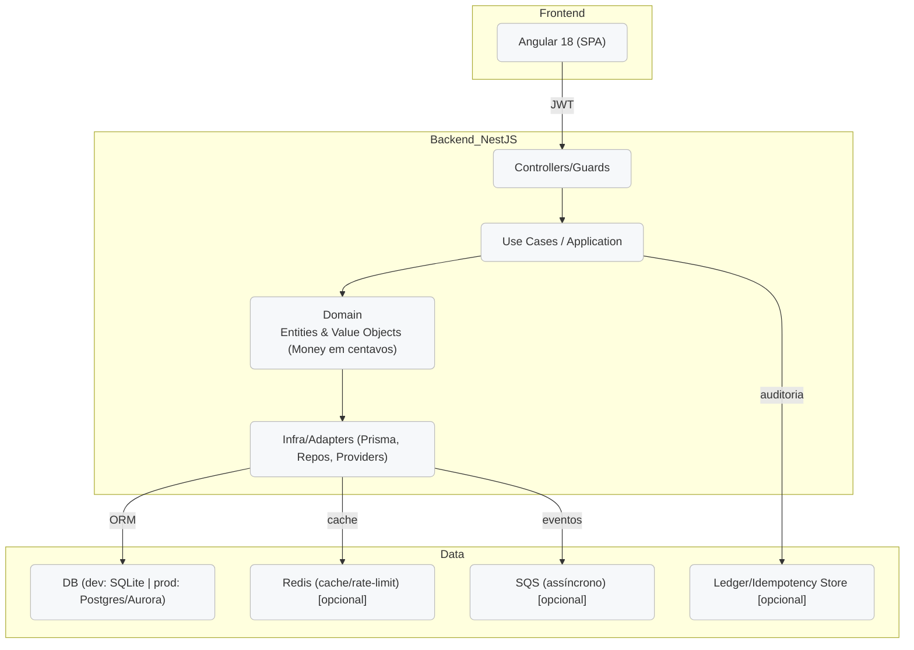

# 🏦 Itaú Customer Management System

Sistema de gerenciamento de clientes com operações financeiras, desenvolvido em **NestJS** (backend) e **Angular** (frontend).

## 📚 Índice

* [Visão Geral](#visão-geral)
* [Estrutura do Repositório](#estrutura-do-repositório)
* [Stack Tecnológico](#stack-tecnológico)
* [Guia Rápido (TL;DR)](#guia-rápido-tldr)
* [Configuração Detalhada](#configuração-detalhada)
* [Arquitetura](#arquitetura)
* [Funcionalidades & Status](#funcionalidades--status)
* [API (resumo)](#api-resumo)
* [Testes & Qualidade](#testes--qualidade)
* [Deploy (resumo)](#deploy-resumo)
* [Roadmap](#roadmap)
* [Contribuição](#contribuição)
* [Autor](#autor)

---

## 🎯 Visão Geral

Aplicação full-stack para:

* **CRUD de clientes**
* **Depósitos e saques** com regras de negócio consistentes
* **Autenticação JWT**
* **Auditoria financeira** (base para ledger/idempotência)

> **Dev** usa **SQLite + Prisma**. É possível apontar para Postgres em **staging/prod** sem mudanças de código (apenas `DATABASE_URL`).

---

## 🧭 Estrutura do Repositório

```
.
├── back/                  # API NestJS (Prisma, JWT, Swagger, testes)
└── front/                 # SPA Angular (Material, Signals)
```

---

## 🧱 Stack Tecnológico

**Backend (NestJS)**

* Node 18+, NestJS 10+
* Prisma ORM (SQLite em dev; Postgres recomendado em prod)
* Auth JWT, validação (class-validator / Zod)
* Swagger/OpenAPI
* Jest (unit/integration)

**Frontend (Angular)**

* Angular 18+, Angular Material
* Angular Signals, Lazy Loading
* SCSS

**Dev & Qualidade**

* ESLint, Prettier
* Scripts NPM padronizados
* (Opcional) Sentry / métricas via endpoints

---

## ⚡ Guia Rápido (TL;DR)

### 1) Clonar

```bash
git clone <repository-url>
cd itau-customer-management
```

### 2) Backend

```bash
cd back
npm install
cp .env.example .env   # Ajuste as variáveis
npx prisma migrate dev
npm run start:dev      # http://localhost:3000  (Swagger em /api/v1/docs)
```

### 3) Frontend

```bash
cd ../front
npm install
npm start              # http://localhost:4200
```

---

## 🔧 Configuração Detalhada

### `.env` (backend – exemplo)

```env
NODE_ENV=development
PORT=3000
API_PREFIX=api/v1
API_VERSION=1.0.0

# DB (dev: SQLite; prod: Postgres/Aurora)
DATABASE_PROVIDER=sqlite
DATABASE_URL="file:./dev.db"

# JWT
JWT_SECRET=your-32-char-min-secret
JWT_EXPIRES_IN=1h
JWT_REFRESH_SECRET=your-32-char-min-refresh
JWT_REFRESH_EXPIRES_IN=7d

# Security
BCRYPT_ROUNDS=12
CORS_ORIGINS=http://localhost:4200

# Features
FEATURE_SWAGGER_ENABLED=true
FEATURE_METRICS_ENABLED=true
FEATURE_HEALTH_CHECK_ENABLED=true
```

### Scripts úteis (backend)

```bash
npm run start:dev         # dev
npm run build             # build prod
npm run start:prod        # start prod
npm run test              # unit tests
npm run test:cov          # coverage
npm run test:watch        # watch
```

---

## 🏗️ Arquitetura

### 1) Camadas da Aplicação



**Decisões de domínio**

* **Money em centavos (integer)** para evitar erros de ponto flutuante
* **Transações** em operações de débito/crédito
* **Idempotência** para replays de requisições financeiras
* **Ledger** para trilha de auditoria (planejado/expansível)

### 2) (Opcional) Desenho de Escala na AWS

> Esta visão é **opcional** para produção e segue boas práticas do case.

```mermaid
flowchart TD
  subgraph EDGE["Edge"]
    R53[Route 53 (DNS)]
    CF[CloudFront (2 origens)]
    WAF[WAF (regras gerenciadas + rate)]
    R53 --> CF --> WAF
  end

  subgraph ORIGINS["CloudFront Origins"]
    S3SPA[S3 (Angular SPA)]
    ALB[ALB (HTTP/HTTPS)]
    CF -- "/, /assets/*" --> S3SPA
    CF -- "/api/*" --> ALB
  end

  subgraph VPC["VPC (isolada)"]
    subgraph PUB["Subnets Públicas"]
      ALB
    end
    subgraph PRIV["Subnets Privadas"]
      ECS[ECS Fargate: NestJS]
      RDSP[(Aurora Postgres + RDS Proxy)]
      REDIS[(ElastiCache Redis)]
      SQS[(SQS)]
      SM[(Secrets Manager)]
      CW[(CloudWatch Logs/Metrics)]
      XR[(X-Ray/Tracing)]
      VPCE[VPC Endpoints]
    end
    ALB --> ECS
    ECS --> RDSP
    ECS --> REDIS
    ECS --> SQS
    ECS --> SM
    ECS --> CW
    ECS --> XR
    ECS --> VPCE
  end

  USER[Usuário] --> R53
```

---

## ✅ Funcionalidades & Status

### Implementadas

* 👥 **Clientes**: criar, listar, obter, atualizar, desativar (soft delete)
* 🔐 **Autenticação JWT** (login/guards)
* 💸 **Depósito/Saque** com validações e precisão em **centavos**
* 🧪 **Swagger** (docs), **Health Check** (flag), **logs básicos**
* 🧭 **Angular SPA** com Material/Signals, interceptors de auth

### Em andamento / Planejadas

* 🧾 **Ledger** completo de transações + **idempotência** persisitida
* 🧱 **Rate limiting** e **cache** via Redis
* 📈 **Dashboard analítico** e gráficos
* 🧳 **Jobs assíncronos** (SQS/Bull)
* 🔍 **Observabilidade** (métricas/tracing avançado)
* 🐳 **Containerização** e **CI/CD** completos

> Mantive apenas como “implementado” o que é típico no seu código atual; os demais ficaram como **planejado** para não superprometer.

---

## 📡 API (resumo)

### Auth

```
POST /api/v1/auth/token
```

### Clientes

```
GET    /api/v1/clientes
POST   /api/v1/clientes
GET    /api/v1/clientes/:id
PUT    /api/v1/clientes/:id
DELETE /api/v1/clientes/:id
```

### Operações Financeiras

```
POST /api/v1/clientes/:id/depositar
POST /api/v1/clientes/:id/sacar
```

> **Docs completas**: `http://localhost:3000/api/v1/docs`

---

## 🧪 Testes & Qualidade

**Backend**

```bash
cd back
npm run test
npm run test:cov
npm run test:watch
```

**Frontend**

```bash
cd front
npm run test
# e2e (se configurado)
npm run e2e
```

**Padrões**

* ESLint + Prettier
* Cobertura mínima recomendada: **≥ 80%**

---

## 🚀 Deploy (resumo)

**Backend**

```bash
cd back
npm run build
npx prisma migrate deploy
npm run start:prod
```

**Frontend**

```bash
cd front
npm run build     # artefatos em dist/
```

**Docker (exemplo backend)**

```dockerfile
FROM node:18-alpine
WORKDIR /app
COPY package*.json ./
RUN npm ci --only=production
COPY . .
RUN npm run build
EXPOSE 3000
CMD ["npm", "run", "start:prod"]
```

> **Prod**: preferir Postgres (ex.: RDS/Aurora) e segredos via **Secrets Manager**. Em dev, **SQLite** é suficiente.

---

## 🗺️ Roadmap

* [ ] Ledger + idempotência persistida
* [ ] Rate limiting granular (app + WAF)
* [ ] Cache Redis (listas/consultas quentes)
* [ ] Jobs assíncronos (SQS/Bull)
* [ ] Observabilidade (métricas/tracing avançado)
* [ ] CI/CD + Docker Compose/K8s
* [ ] Relatórios exportáveis (CSV/PDF) e gráficos

---

## 🤝 Contribuição

1. Faça **fork**
2. Crie a **branch**: `git checkout -b feature/xyz`
3. **Commit**: `git commit -m "feat: xyz"`
4. **Push**: `git push origin feature/xyz`
5. Abra um **Pull Request**

**Padrões**

* ESLint/Prettier
* Commits convencionais
* Testes ≥ 80%

---

## 👨‍💻 Autor

**Gabriel**
[Email](mailto:gabrielevaristovcp@gmail.com)

---

*Feito com ❤️ para demonstrar arquitetura limpa, segurança e consistência financeira.*
